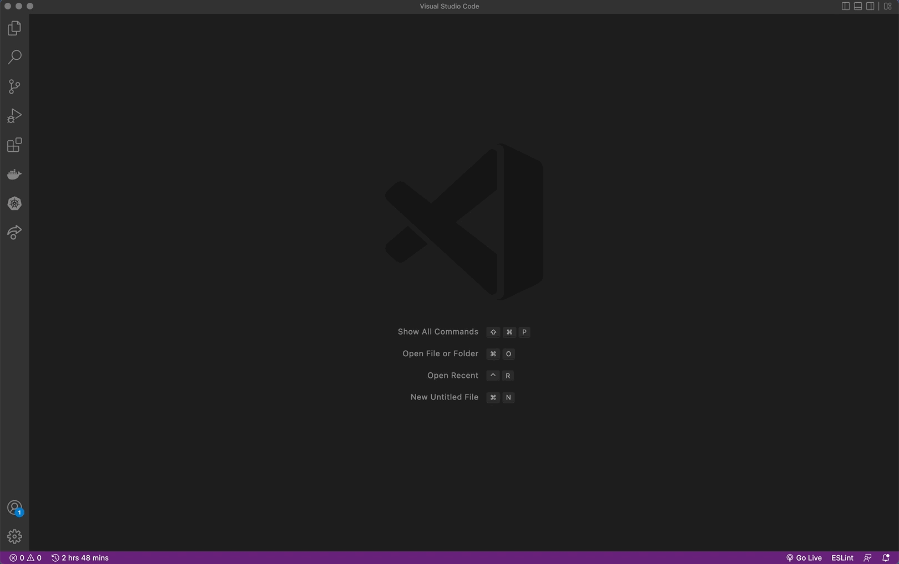

# Java.toString to JSON Object 🚀

This is an extension for Visual Studio Code that allows you to convert Java.toString to JSON Object.

## Usage 
### Use Command

**Java.toString to JSON**: Converts Java.toString to JSON object

<!--  -->

### Use Keybinding
`ctrl+shift+d` to Window and Linux, `cmd+shift+d` MacOS

<!-- ## Known Issues -->

## Release Notes
### 1.0.1
- Fix to parse array with primitives values

### 1.0.0
- Initial release

---

## Contributing

Feel free to fork this repository and use it the way you like. If you want to propose a nice new feature, just create a pull request from you forked branch.

**Successes!**

---
Author: [@BryanCondor](https://github.com/bryancondor)